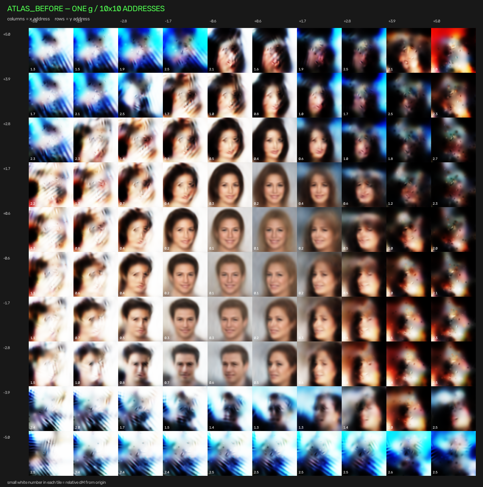
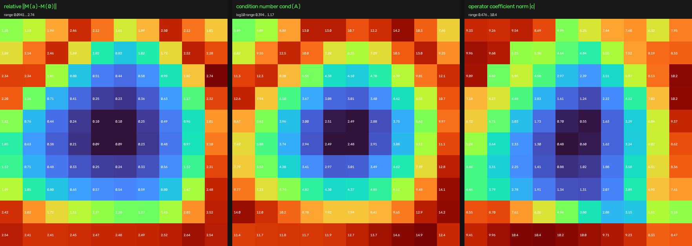
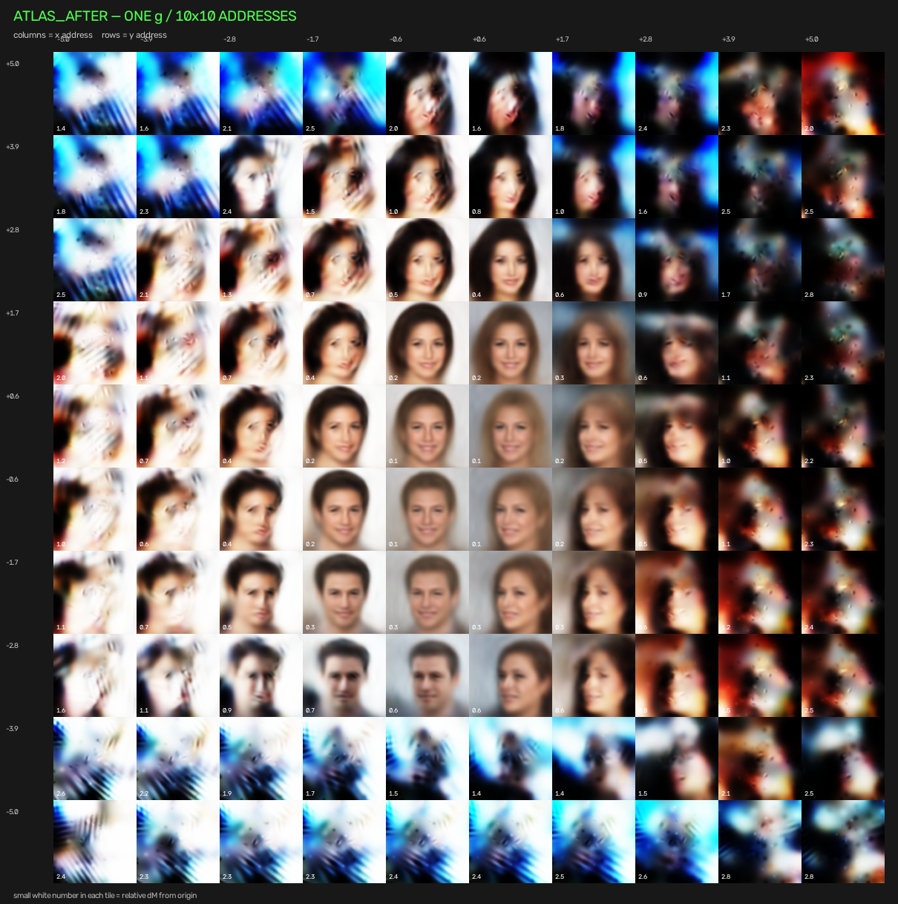
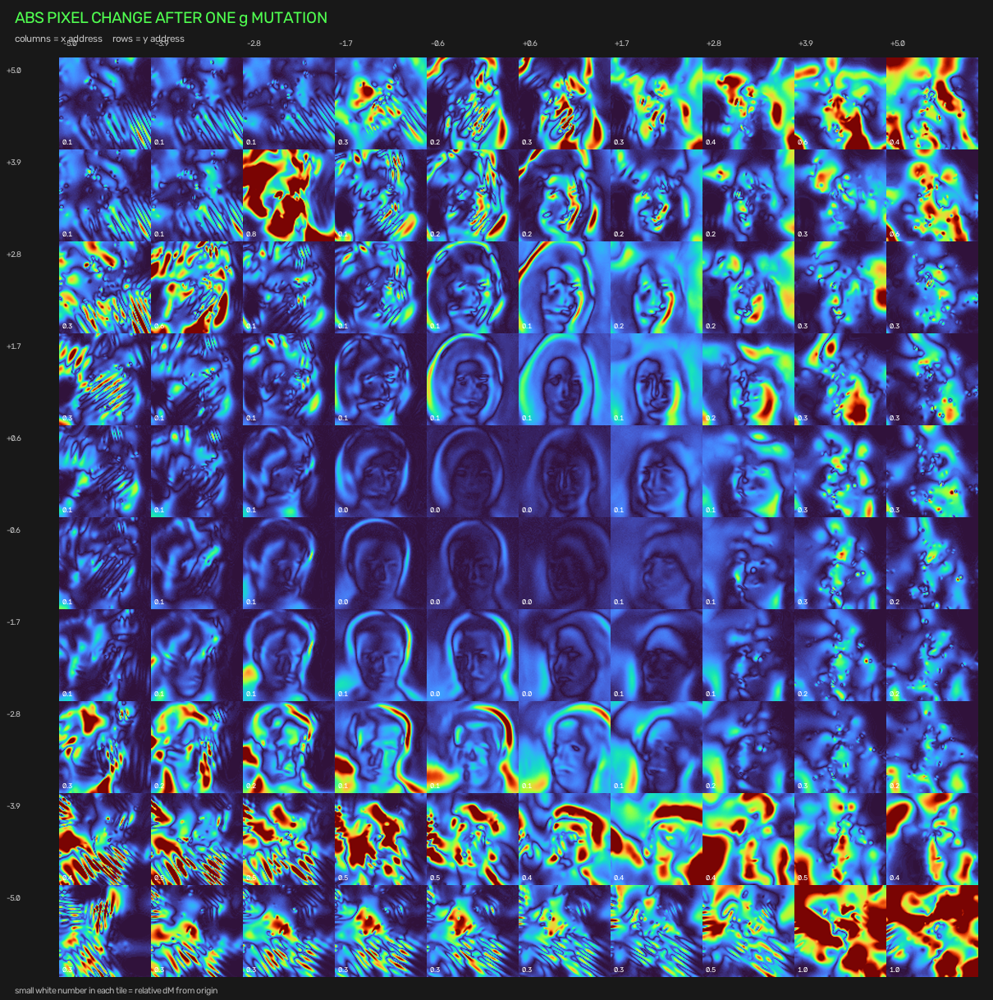
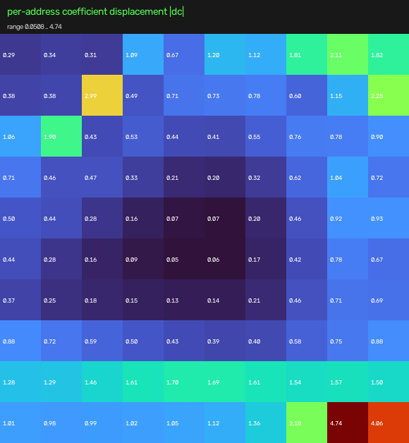

# One Plate, Many Views

## Address-conditioned operator families inside a learned face manifold

**Antti Luode**  
Working paper / experimental note — September 2026



## Abstract

`SplatWorld3` asks a narrow question: can one small persistent substrate generate a **family of different dense transformations** depending on how it is queried, and can a local change to that substrate deform the family globally without storing or editing each transformation separately?

The persistent object is a material vector `g` on a small reciprocal graph. A three-coordinate query `a=(x,y,z)` changes the graph loading and exposes a dense complex operator

```text
M_g(a) = [K(g) + D(a) + i gamma I]^-1 .
```

The operator response is projected into six locally measured transport-like directions of an existing CelebA face decoder. A 10x10 sweep over a two-dimensional address plane therefore produces 100 decoded images from the **same `g`**, without storing one matrix or one latent code per address.

The resulting atlas is not random. Neighboring addresses have much smaller coefficient-space separation than arbitrary pairs, and the six-dimensional coefficient family is strongly concentrated in a few collective directions: the first two principal components explain **78.21%** of variance, the first three **89.41%**, and the first four **96.69%**. The central region forms a smooth visual chart, while large-radius addresses enter high-gain / less-well-conditioned regimes that reproduce the previously observed SplatWorld "fire" failure.

A single conservative material transfer, `g_8 -> g_5` with `delta g = 0.12`, leaves total material exactly unchanged but moves the operator response at every address by a mean coefficient norm of **0.8437**, with a maximum of **4.743**. The before/after spatial maps remain highly correlated (`dM`: **0.9934**, condition number: **0.9890**, coefficient norm: **0.9797**), while adjacent mutation vectors have median cosine similarity **0.915**. Thus the edit does not replace the atlas with an unrelated one; it produces a structured deformation field over the existing address space.

The experiment therefore supports a limited claim: **one persistent material object can generate a continuous, globally deformable landscape of address-conditioned transformations.** It does not yet show that the coordinates are physical pose, that the atlas is a 3-D world, or that the substrate has learned semantic geometry.

---

## 1. Motivation

The usual neural-network picture stores a transformation explicitly:

```text
store W
query x
return y = W x
```

`ObjektiYksi` motivated a different computational object:

```text
store g
query address a
expose M_g(a)
apply the resulting transformation
```

The difference is not merely notation. If one shared `g` generates many addressed operators, then changing `g` can alter many transformations together. The object being stored is no longer one matrix; it is a substrate from which a **family of matrices** is generated when interrogated.

That suggested a visual question. Instead of measuring operator error numerically, what happens if the addressed family is inserted into an already-trained image manifold and the entire address space is rendered at once?

The informal analogy is a holographic plate: one distributed object can yield different reconstructions under different ways of interrogation. The analogy is useful only at this structural level. `SplatWorld3` is not optical holography and the present experiment does not establish holographic memory in the technical sense.

---

## 2. Model

### 2.1 Persistent substrate

The substrate is a small reciprocal graph with positive edge couplings collected in

```text
g = (g_1, ..., g_E).
```

These couplings form a Laplacian-like stiffness matrix `K(g)`. The stored object is therefore `g`, not a matrix per visual state.

### 2.2 Address-conditioned operator

For an address

```text
a = (x, y, z),
```

the model changes the diagonal loading and carrier detuning of the graph, then solves

```text
M_g(a) = [K(g) + D(a) + i gamma I]^-1 .
```

`M_g(a)` is a full dense complex operator. The current implementation samples it with a fixed complex drive vector and converts the real response into bounded coefficients.

### 2.3 Coupling to SplatWorld

Around a committed latent identity `z0`, the original SplatWorld procedure probes the decoder and selects six directions with comparatively strong transport-like image change. These form a local basis

```text
B(z0).
```

The operator produces coefficients `c_g(a)`, and the visual query becomes

```text
z(a) = z0 + motion_gain * c_g(a) B(z0).
```

The atlas experiment intentionally uses an extreme `motion_gain = 9` in order to make widely separated operator addresses visibly distinct. This is important: `B(z0)` is measured locally, so large moves are extrapolations beyond the region in which the local chart was measured.

---

## 3. Operator atlas experiment

The atlas sampled a regular `10 x 10` grid with

```text
x, y in [-5, +5]
z = 0
motion_gain = 9.
```

Every tile in the image below comes from the **same persistent material vector `g`**. Only the query address changes.


The small white number in each tile is the relative matrix displacement

```text
||M_g(a) - M_g(0)|| / ||M_g(0)||.
```

The matching diagnostics are shown here:



The three panels show relative operator distance from the origin, condition number of the physical solve, and coefficient norm `|c|`.

---

## 4. Result 1 — the addressed family is structured, not a table of independent outputs

The 100 six-dimensional coefficient vectors form a smooth address-dependent field.

Across horizontal and vertical nearest neighbors, mean coefficient-space distance is **2.536**. Across all unordered address pairs, mean distance is **7.501**. Thus neighboring addresses are only

```text
2.536 / 7.501 = 0.338
```

of the mean separation of arbitrary pairs. Using medians gives an even smaller ratio of **0.222**.

A PCA of the 100 coefficient vectors gives cumulative explained variance:

| number of PCs | variance explained |
|---:|---:|
| 1 | 51.22% |
| 2 | 78.21% |
| 3 | 89.41% |
| 4 | 96.69% |
| 5 | 99.43% |
| 6 | 100% |

The address-conditioned family is therefore six-dimensional by construction but, on this plane and for this plate, most of its variation lies in a low-dimensional collective subspace.

Visually the same structure appears as a broad central region of recognizable faces and continuous transitions. The atlas does not look like 100 independently sampled identities. There are persistent neighborhoods and broad transition bands.

This is the first limited sense in which the object resembles a "world": changing the query produces related states because they are generated by one continuous operator family rather than by independent lookup slots.

---

## 5. Result 2 — the outer atlas is partly an operator / local-chart horizon

The visually dramatic outer regions should not be overinterpreted as meaningful learned states.

Relative operator distance and physical condition number are strongly correlated across the 100 addresses:

```text
corr(dM, cond(A)) = 0.9645.
```

Relative operator distance also correlates with coefficient magnitude:

```text
corr(dM, |c|) = 0.8820.
```

Grouping addresses by radial distance in the `(x,y)` plane makes the trend explicit:

| address radius | cells | mean dM | mean cond(A) | mean |c| |
|---|---:|---:|---:|---:|
| `r < 2` | 12 | 0.191 | 2.815 | 1.112 |
| `2 <= r < 4` | 32 | 0.689 | 5.091 | 3.470 |
| `r >= 4` | 56 | 1.949 | 10.565 | 7.506 |

The central atlas is therefore a relatively mild operator chart. Moving outward simultaneously increases operator deformation, solve conditioning, and coefficient magnitude. At the edges, the model extrapolates a locally measured decoder basis by very large latent distances. The resulting blue/red streaking and "fire" are consequently best interpreted as a combination of strong operator response and local-chart failure, not as evidence for exotic hidden visual content.

This boundary is useful. A prospective learned world should be judged mainly by what it can organize **inside a controlled, non-fire operating region**.

---

## 6. Result 3 — one local conserved edit deforms the whole atlas

The central experiment changes the shared substrate once and redraws all 100 addresses.

The selected mutation was

```text
g_8 -= 0.12
g_5 += 0.12
```

with

```text
sum(g) before = 3.9431981293
sum(g) after  = 3.9431981293.
```

Thus the edit redistributes material but does not add or remove it.

The resulting atlas is:



The raw visual change is shown here:



and the operator-response displacement across address space is:



The one edit produces:

| quantity | value |
|---|---:|
| mean `|delta c|` over 100 addresses | 0.8437 |
| maximum `|delta c|` | 4.7430 |
| mean absolute pixel difference | 11.64 / 255 |
| largest tile mean pixel difference | 56.97 / 255 |

The effect is strongly address dependent. By radius:

| address radius | mean `|delta c|` |
|---|---:|
| `r < 2` | 0.129 |
| `2 <= r < 4` | 0.541 |
| `r >= 4` | 1.169 |

So one local edit does not act as a uniform global brightness or gain knob. Different addressed operators respond by different amounts.

Yet the family is not scrambled. Comparing the before and after metric maps gives spatial correlations:

```text
relative dM map:   0.9934
condition map:     0.9890
coefficient norm:  0.9797
```

The broad geometry of the operator landscape survives the mutation.

Even more directly, define the six-dimensional mutation field

```text
delta c(a) = c_{g'}(a) - c_g(a).
```

For horizontally and vertically adjacent addresses, the **median cosine similarity** of `delta c` is **0.915**. Nearby locations therefore usually move in similar directions under the same material edit, although local reversals also occur near some boundaries.

This is the main result of the atlas experiment:

> **A single local conserved change to the shared substrate produces a spatially structured deformation field over many addressed transformations, while the global organization of the family largely persists.**

---

## 7. What this does and does not reveal

### Supported by this experiment

1. One persistent `g` generates many different dense operators `M_g(a)`.
2. The addressed operator responses vary continuously enough to form coherent neighborhoods in coefficient space.
3. The resulting visual atlas contains broad continuous regions rather than behaving like a set of independent random slots.
4. One conservative local material change affects many addresses at once.
5. That change is structured: neighboring addressed responses usually deform in similar directions, and the large-scale operator landscape survives.

### Not established

1. `x` and `y` are **not** learned camera coordinates.
2. The atlas is **not** a reconstructed 3-D head.
3. Different tiles are not guaranteed to preserve one identity.
4. The outer "fire" is not evidence of a physical singularity or hidden world; it is strongly confounded by large operator response and extrapolation of a local latent basis.
5. The atlas mutation is selected for high operator visibility. It is not a learned credit-assignment rule.
6. One seed, one identity, and one atlas are not evidence of a universal phenomenon.

Accordingly, the phrase **holographic plate** should currently be read as an architectural analogy:

```text
shared distributed substrate + query -> one of many related manifestations.
```

The stronger claim that the plate stores a coherent world remains a hypothesis.

---

## 8. The next decisive experiment: teach relations, not slots

The present plate is untrained with respect to visual semantics. Its address field is smooth, but the meanings of its coordinates are accidental mixtures of identity, apparent sex, hair, pose, and other decoder directions.

The next test should therefore impose a small amount of semantic geometry and judge the **untrained space between the constraints**.

A clean experiment is:

```text
four safe addresses inside the central non-fire region
        +
four target views of the same identity
        +
change only g
        ->
render the entire address atlas again.
```

The key measurement is not training error at the four target addresses. A lookup-like system can memorize four targets.

The interesting question is whether untrained intermediate addresses become coherent transitions, for example

```text
left profile -> three-quarter -> front -> three-quarter -> right profile.
```

If the interior remains garbage or unrelated identities, the plate is a multiplexed operator memory but not a world model.

If the interior becomes systematically consistent without being directly supervised, then the shared substrate has learned **relations among addressed transformations**, not merely isolated outputs. That would justify a stronger interpretation:

```text
few observations -> one shared plate -> an interpolated addressed world.
```

---

## 9. Connection back to ObjektiYksi

`ObjektiYksi` established the computational distinction

```text
persistent material g
      ->
address-conditioned operator M_g(a)
      ->
computation.
```

Its later experiments showed that multiple dense addressed operators can share one conserved substrate and that interference between addressed operators need not imply incompatibility.

`SplatWorld3` adds a different capability: it makes the family **visible all at once**.

The 10x10 atlas turns an abstract set

```text
{ M_g(a) : a in A }
```

into a spatial field of manifestations. The mutation experiment then lets us see what it means for one edit to `g` to deform many members of that set simultaneously.

The useful conceptual object is therefore not one matrix and not one image. It is

```text
one persistent substrate
        ->
a continuous family of transformations
        ->
a structured family of observable states.
```

That is the object this paper leaves standing.

---

## 10. Reproduction

Install dependencies and verify the operator / bridge tests:

```bash
pip install -r requirements.txt
python operator_plate.py
python splatworld3.py --selftest
python operator_atlas.py --selftest
```

Render the atlas used here:

```bash
python operator_atlas.py --address_span 5 --motion_gain 9 --grid 10 --mutate --show
```

The committed result directory contains:

```text
operator_atlas/
  atlas_before_faces.png
  atlas_before_metrics.png
  atlas_before_data.npz
  atlas_after_faces.png
  atlas_after_metrics.png
  atlas_after_data.npz
  atlas_difference.png
  atlas_mutation_metrics.png
  atlas_mutation_summary.json
```

The PNGs are the visual record. The NPZ files contain the exact address grid, coefficient vectors, operator-distance map, condition-number map, coefficient norms, committed latent identity, material vector, and operator scale. The JSON file freezes the mutation and its aggregate effects.

---

## Conclusion

The atlas does not demonstrate a holographic world. It demonstrates a more modest object that makes that possibility experimentally meaningful.

A single small material state `g` produces a continuous address-conditioned family of dense transformations. When projected through a learned visual manifold, that family forms coherent neighborhoods and broad visual regions. A single local conserved edit to `g` changes many addressed outputs at once, but changes them as a structured deformation field rather than replacing the operator landscape with an unrelated one.

The compact result is:

```text
one g -> many M_g(a)
one delta g -> a coherent deformation of many M_g(a)
```

The next question is no longer whether one plate can expose many states. It can in this toy. The next question is whether a few learned constraints can make the **relations between those states** become useful, coherent, and world-like.
