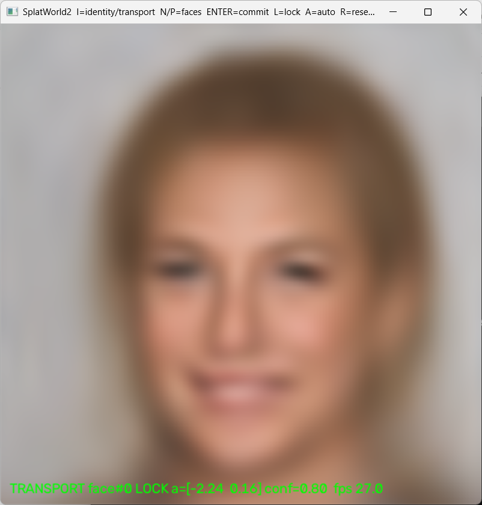

# SplatWorld2



A no-retraining experiment built from the original **SplatWorld** CelebA decoder.

The model itself is unchanged: `splat_decoder.onnx` maps a 128-D latent point to a 96x96 Gabor-rendered face. SplatWorld2 changes how we explore that learned face space and how we display local motion without allowing repeated reconstruction to dissolve the image.

The useful picture is now:

```text
GLOBAL learned face manifold
        |
        | surf identity
        v
   choose face z0
        |
        | measure this face locally
        v
LOCAL transport-like modes B
        |
        v
   z = z0 + a B
```

"Eigenface" is useful shorthand for the intuition, but this is **not PCA eigenfaces**. It is a nonlinear learned latent manifold. The important discovery in SplatWorld2 is that the useful local modes appear to depend strongly on *where you are in that manifold*.

## Tonight's observation: every face seems to have a different local rig

This became visible only after the old destructive-looking blur/fire behavior was suppressed enough that nearby changes could be watched cleanly.

Around some committed faces, the best locally measured directions produce something that looks like:

- head yaw / turning left-right,
- head motion up-down,
- coarse pose or scale.

Around other faces, the corresponding strongest directions instead produce:

- long hair <-> short hair,
- face shape changes,
- expression/appearance changes,
- mixtures of pose and appearance.

So the current interpretation is **not** "there is one universal head-turn axis and it sometimes breaks." It is:

> **The global face manifold contains many freedoms, but the locally strong / transport-like freedoms differ from identity to identity. Each location exposes its own small local rig.**

Locally, for decoder `F`,

```text
I = F(z)

dI ~= J(z0) dz
```

and there is no reason for

```text
J(z_face_A) == J(z_face_B).
```

The local Jacobian can therefore have different dominant directions at different identities. A direction that is mostly yaw near one face may be hair/shape near another.

This also changes how we interpret an older SplatWorld observation. In the earlier **fire / destructive transition** behavior, we often assumed the system had simply broken when a turn became unstable. That may still have happened in some cases, but the failure obscured another possibility: the trajectory had entered a region whose local degrees of freedom were simply *different*. Once SplatWorld2 removed enough of the accumulated visual destruction, that distinction became visible by eye.

That is presently an observation, not a finished measurement. A natural next experiment would probe many committed identities, render +/- excursions along several local directions for each, and build an atlas of which identities have pose-like, expression-like, hair-like, or repaint-like local modes.

## What SplatWorld2 changed

For a committed identity `z0`, SplatWorld2 samples many orthonormal latent directions `d` and renders:

```text
z0 - eps*d    and    z0 + eps*d
```

It asks how much of each image change can be explained by **optical transport** rather than repainting. Directions are ranked by a transport score:

```text
latent direction
      |
      v
render minus / plus
      |
      v
dense optical flow
      |
      +--> how much raw image error disappears after warping?
```

The best local directions become the transport control plane around that face.

The second change is the anti-blur rule:

> **Every locked frame is reconstructed from the same immutable anchor. Never from the previous displayed frame.**

The ONNX render supplies the changing guide. High-frequency detail comes from one frozen anchor and is warped into the guide. Therefore the display does not contain the old recurrence

```text
frame N -> lossy representation -> frame N+1 -> lossy representation -> ...
```

that lets small reconstruction losses compound into progressive blur/fire.

This does **not** turn a 96px decoder into a high-resolution identity model. It only prevents the display loop itself from repeatedly destroying detail that was already present.

## Two exploration scales

### IDENTITY mode — move through the global face manifold

Press **I** to enter identity mode, then drag. This rotates/moves the latent face point through the learned population manifold, like the original SplatWorld SURF behavior.

Identity mode is deliberately not locked to the old face: preserving the previous anchor while trying to become another identity would make the lock fight the transition.

When you find a face you want to inspect, press **ENTER**. That face becomes the new `z0`; SplatWorld2 renders a fresh immutable anchor and re-measures the local transport basis around it.

### TRANSPORT mode — inspect the local rig

After committing a face, drag in transport mode. You are moving only through the locally measured transport-like directions around that identity.

This is where the face-dependent behavior became obvious: one committed identity may turn its head while another changes hair length or moves vertically.

## Run

No training is required. `splat_decoder.onnx` lives directly in this repo.

```bash
pip install -r requirements.txt
python splatworld2.py --selftest
python splatworld2.py
```

To inspect the local transport ranking numerically:

```bash
python splatworld2.py --probe
```

## Controls

- **I** — toggle IDENTITY / TRANSPORT mode
- **drag in IDENTITY** — surf through learned faces
- **ENTER** — commit the current identity, rebuild anchor, re-probe local modes
- **N** — jump to a fresh random identity and commit it
- **P** — return to the previous committed identity
- **drag in TRANSPORT** — move in the current face's measured local directions
- **right drag** — finer local movement
- **L** — raw ONNX / identity-lock A/B
- **A** — automatic local transport motion
- **R** — reset local motion to the current committed identity
- **S** — save frame
- **Q** — quit

Try automatic local motion:

```bash
python splatworld2.py --auto
```

## Optional sharper anchor texture

You can provide a sharper image as the immutable detail reservoir:

```bash
python splatworld2.py --anchor_image face.jpg
```

This does not encode that photograph into the model or turn SplatWorld2 into a general reenactment system. It only supplies texture/detail for the current anchor compositor.

## Knobs worth touching

```text
--probe_dirs 32        latent directions measured around each committed face
--probe_eps 0.35       +/- local step used for transport measurement
--span 3.0             max live coefficient on each selected local direction
--detail_sigma 1.2     which anchor frequencies count as retained detail
--detail_gain 1.0      amount of warped detail added back
--confidence_sigma .10 how quickly bad-flow regions lose anchor detail
--size 640             display/compositor resolution
```

The ONNX has a dynamic batch axis, so startup probes are batched. `onnxruntime` is required; CUDA is used automatically if the installed runtime exposes `CUDAExecutionProvider`.

## The useful gate

Do not judge only whether a face looks pretty. Pick several identities and ask:

1. Does the identity manifold really move between distinct faces smoothly?
2. After committing each face, what do its strongest local directions actually do?
3. Are some identities strongly pose-riggable while others are dominated by hair/expression/appearance change?
4. Does `L` show that the immutable-anchor path prevents progressive softening without inventing motion that the decoder did not produce?
5. If an apparent mode changes between identities, is that repeatable after revisiting the same committed face?

A strong result would be a repeatable **local-mode atlas**: the same global decoder, but measurably different local controllable freedoms in different regions of its learned face manifold.

## Why this exists

The original SplatWorld made it easy to fly through a learned population of faces, but destructive transitions could make it hard to tell whether a trajectory had exposed meaningful local structure or merely collapsed visually.

SplatWorld2 separates two questions:

```text
Where am I in the global face manifold?

and

What directions are locally available around this face?
```

Then it removes one major confound by refusing to recursively reconstruct the previous displayed frame.

No new physics and no claim that optical flow is a new AI architecture. The interesting result is more modest: once the destructive display failure was reduced, the old face manifold became easier to interrogate, and its local freedoms no longer looked uniform.

## Provenance

Descendant of `anttiluode/SplatWorld`; reuses its existing `splat_decoder.onnx`. The model was trained on CelebA, so check CelebA's own terms before commercial use of model outputs.
